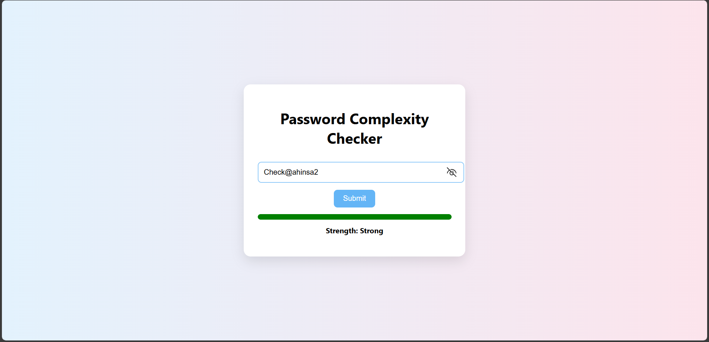

#  Password Strength Checker

A simple and responsive web application that checks the strength of a  password in real time. Built using HTML, CSS, and JavaScript.

##  Features

- Real-time password strength evaluation
- Dynamic feedback using colors and messages
- Responsive and minimal UI design
- Monochrome light purple gradient background

##  How It Works

The password is evaluated based on:
- Length of the password
- Use of uppercase and lowercase letters
- Inclusion of numbers
- Inclusion of special characters

The application then categorizes the password as:
- Weak
- Medium
- Strong

## 🖼️ Preview

 
##  Files Included

- `index.html` – Structure of the web page
- `style.css` – Monochrome styled design
- `script.js` – Password checking logic

##  How to Use

1. Clone the repository or download the ZIP.
2. Open `index.html` in your browser.
3. Start typing a password to see its strength level.

##  Tech Stack

- HTML
- CSS
- JavaScript (Vanilla)

## 📄 License

This project is open-source and free to use under the [MIT License](./LICENSE).

---

by ***Ahinsa Mohanty***
